# Exploring Continuum Robot Agents For Fire Rescuing in Buildings

**Embodied intelligence for flexible access, visual inspection, and local intervention in buildings.**

[English project page](https://evan0610.github.io/Exploring-Continuum-Robot-Agents-For-Fire-Rescuing-in-Buildings/) · [中文主页](https://evan0610.github.io/Exploring-Continuum-Robot-Agents-For-Fire-Rescuing-in-Buildings/index-zh.html) · [Demonstration video](https://youtu.be/r7klSNvfRIo) · [Research poster](assets/documents/research-poster.pdf)

## Recognition · 三等奖

**Third Prize — 12th Hong Kong University Student Innovation and Entrepreneurship Competition (2026).**

The project received Third Prize in **Innovation: Mathematics and Physics / Mechanics and Control Systems**. CUHK's official award list records the project as **Exploring Continuum Robot Agents for Firefighting in Buildings**. The research record dates the award to May 2026; the award ceremony took place on 30 May 2026.

本项目获得**第十二届香港大学生创新及创业大赛三等奖**，所属类别为创新组「数学及物理／机械及控制系统」。主页沿用项目演示标题，获奖官方列名为 *Exploring Continuum Robot Agents for Firefighting in Buildings*。

Sources: [CUHK research award record](https://research.cuhk.edu.hk/en/prizes/third-prize-of-the-12th-hong-kong-university-student-innovation-a/) · [CUHK event report](https://kto.cuhk.edu.hk/en/news-events/announcements/event-highlight-cuhk-wins-19-awards-at-the-12th-hong-kong-university-student-innovation-and-entrepreneurship-competition-30-may-2026) · [Official award list, page 2](https://www.cpr.cuhk.edu.hk/wp-content/uploads/newscentre/pressrelease/Appendix_eng-2.pdf).

## Project overview

Inspired by flexible endoscopic exploration, the project investigates a continuum robot that carries sensing and working channels through a tubular body. A steerable front end provides close-range observation and local action in restricted spaces. The presentation combines this embodiment with an image-understanding layer and a vision-language-action layer, then illustrates the task workflow in three miniature building scenarios.

<table>
<tr><td width="50%">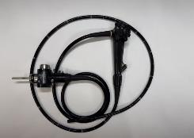</td><td width="50%" align="center">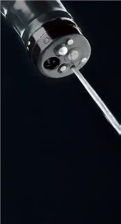</td></tr>
<tr><td><b>Flexible continuum platform.</b> The body brings working channels to the scene while the tip changes orientation.</td><td><b>Multi-channel front end.</b> Observation, illumination, and delivery pathways are integrated at the tip.</td></tr>
</table>

## 1. Research motivation

The PPT describes rescue challenges in dense, high-rise, and ageing buildings: cluttered passages can limit access, small openings can prevent bulkier platforms from entering, and occluded interiors can make target localization difficult. These constraints motivate a robot that can bring a camera and a working outlet closer to the target.

The intended use is to extend inspection and local intervention into building blind zones. Real-fire robustness under heat, smoke, and communication disruption remains a deployment question; the videos below show miniature laboratory tasks.

## 2. Robot intelligence: image understanding and continuum action

The presentation introduces two cooperating layers:

| Layer | Role in the proposed rescue workflow | PPT basis |
|---|---|---|
| **Image-understanding brain** | Interpret the robot view and instructions, identify targets and obstacles, reason about spatial access, and retain scene context during exploration. | Slides 6–7 |
| **Continuum-action brain** | Relate visual observations and language instructions to tip steering, advancement, aiming, spraying, and delivery sequences. | Slide 8 |

A task begins with observation and target localization. The system then selects and executes an action, observes the resulting scene, and adjusts the next action. For delivery, the PPT describes coordinating extension, delivery, and withdrawal in order.

### Project system design

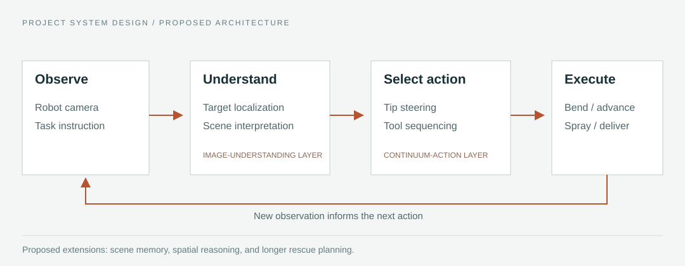

Camera observations and task instructions feed scene understanding, action selection, and robot execution. A new observation informs the next action. This diagram describes the proposed system architecture; scene memory and longer rescue planning are extensions rather than measured results of the miniature demonstrations.

<details>
<summary>Research foundations: RoboBrain 2.0 and EndoVLA</summary>

### Understanding-layer research foundation

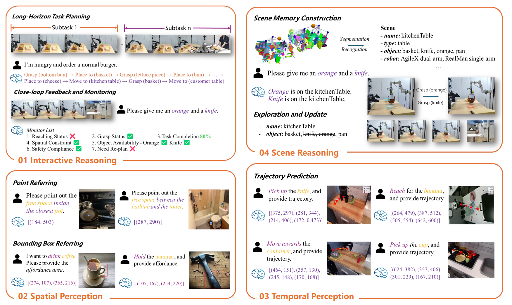

The PPT uses this figure from **RoboBrain 2.0** to explain scene understanding, planning, spatial reasoning, and interactive feedback. It is a figure about related research capabilities; it does not report benchmark results for this firefighting prototype.

Reference: [RoboBrain 2.0 Technical Report](https://arxiv.org/abs/2507.02029).

### Action-layer research foundation

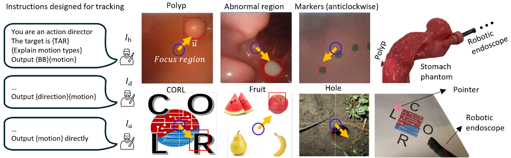

The **EndoVLA** examples motivate a vision-language-action formulation for a flexible instrument. In the rescue setting, the presentation extends that direction to target-centering, tip motion, and ordered tool operation.

Reference: [EndoVLA: Dual-Phase Vision-Language-Action Model for Autonomous Tracking in Endoscopy](https://arxiv.org/abs/2505.15206).


</details>

## 3. Continuum embodiment and working channels

The hardware concept combines a hose-like body with a front end that can bend around the tip axis in any direction. This aims to provide control over outlet orientation as well as flexible access. The PPT discusses both indoor integration with building fire-hose infrastructure and use at the front of an outdoor firefighting platform.

<table>
<tr><td align="center" width="33%">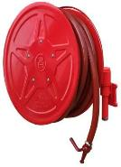</td><td align="center" width="34%"></td><td align="center" width="33%">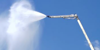</td></tr>
<tr><td><b>Conventional hose:</b> flexible fluid delivery with manually positioned outlet.</td><td><b>Continuum platform:</b> steerable front end with robot-view sensing and working channels.</td><td><b>Outdoor application:</b> the PPT motivates directional control at an elevated outlet.</td></tr>
</table>

| Working pathway | Function described in the PPT |
|---|---|
| Visual imaging | Close-range observation for target localization and navigation. |
| Optical | Illumination near the robot tip. |
| Liquid | Water delivery for directed spraying. |
| Gas | A proposed channel for suppression or support functions. |
| Material transport | Delivery of a mask near the rescue target. |

The miniature videos show water spraying and mask transport. They do not establish gas suppression performance or clinical life-support efficacy.

## 4. Miniature building setups

The team constructed three building mock-ups and placed targets inside or outside them. The robot camera shows the local task view; the external camera shows robot movement in the building setup.

<table>
<tr><td width="33%" align="center">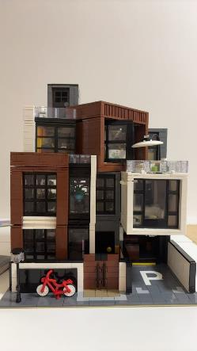</td><td width="34%" align="center">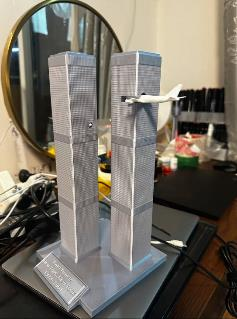</td><td width="33%" align="center">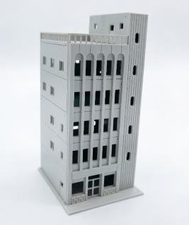</td></tr>
<tr><td><b>High-rise:</b> exterior target localization and directed spraying.</td><td><b>Residential:</b> indoor suppression followed by mask delivery.</td><td><b>Factory:</b> exterior-to-interior access with a combined task sequence.</td></tr>
</table>

### High-rise: exterior target tracking and spraying

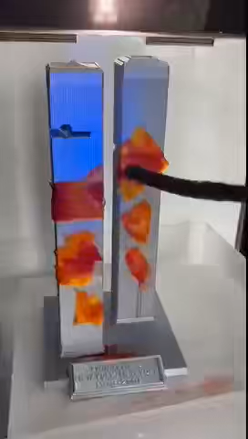

1. Locate the façade target and center it in the robot view.
2. Direct water toward the target and adjust the tip as new observations arrive.
3. Stop spraying at the end of the task.

The robot view explains the aiming decision; the external view shows the relation between the outlet and the façade target. [Robot-view clip](assets/videos/demo-01.mp4) · [External-view clip](assets/videos/demo-02.mp4).

### Residential: indoor suppression followed by delivery

<table><tr><td width="50%" align="center">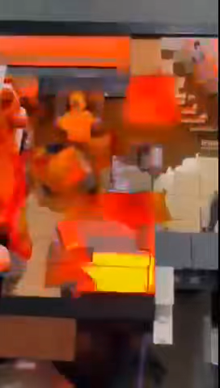</td><td width="50%" align="center">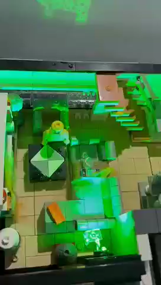</td></tr><tr><td><b>Stage 1:</b> locate the indoor target and direct water toward it.</td><td><b>Stage 2:</b> stop spraying and switch to mask delivery.</td></tr></table>

The presentation describes the robot operating from a building's internal fire-hose location. After the suppression phase, the material channel transports a mask near the rescue target, illustrating a transition between two tools within one task.

Suppression: [Robot view](assets/videos/demo-03.mp4) · [External view](assets/videos/demo-04.mp4). Delivery: [Robot view](assets/videos/demo-05.mp4) · [External view](assets/videos/demo-06.mp4).

### Factory: work outside, enter the building, continue inside

<table><tr><td width="50%" align="center">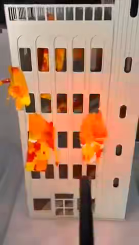</td><td width="50%" align="center">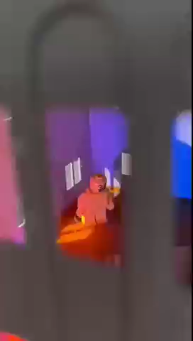</td></tr><tr><td><b>Exterior task:</b> locate the outside target and direct water toward it.</td><td><b>Interior task:</b> advance through an opening and continue the rescue sequence.</td></tr></table>

1. Perform exterior localization and spraying.
2. Stop the exterior spray and advance through a window or opening.
3. Locate the interior target and perform local spraying.
4. Switch to mask delivery near the rescue target.

This scenario combines access planning with a change of working location and a later change of tool operation. Exterior: [Robot view](assets/videos/demo-10.mp4) · [External view](assets/videos/demo-07.mp4). Interior / delivery: [Robot view](assets/videos/demo-08.mp4) · [External view](assets/videos/demo-09.mp4).

[Watch all scenarios on the interactive project page](https://evan0610.github.io/Exploring-Continuum-Robot-Agents-For-Fire-Rescuing-in-Buildings/#demos).

## Current scope

This repository contains the project homepage, explanatory figures, and the 10 original presentation clips. The supplied material establishes prototype demonstrations in miniature scenes and outlines the intended system architecture. The clips do not establish live-fire suppression, clinical oxygen delivery, or quantitative autonomy. Paired views have different durations and are not synchronized. Controlled trial counts, benchmark tables, real-fire deployment evidence, and robot training / control source code are not included.

## Website development

The site uses static HTML, CSS, and JavaScript with relative asset paths. No build step is required.

```bash
python -m http.server 8000
python scripts/check_site.py
```

See [deployment instructions](docs/DEPLOYMENT.md), [content guide](docs/CONTENT_GUIDE.md), and [source map](docs/SOURCE_MAP.md). The GitHub Actions workflow deploys the homepage after updates to `main`.

## Materials and credits

The research narrative primarily follows the supplied 14-slide presentation. Prototype photographs, related-work figures, and videos retain their source roles; the poster is a supplementary resource. The layout takes structural inspiration from [Nerfies](https://nerfies.github.io/) and [CLIPort](https://cliport.github.io/). No template code was copied. Research materials and third-party figures retain their original rights.
