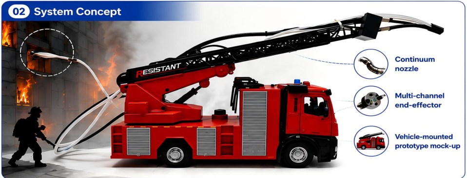

# RescueBrain

### Exploring Continuum Robot Agents for Fire Rescuing in Buildings

A research project website for embodied continuum robotics in building fire rescue. This repository contains the **project page and research media**, with system concepts and miniature laboratory demonstrations. Robot control / training code is not included in the supplied materials.



[Research poster](assets/documents/research-poster.pdf) · [Demonstration video](https://youtu.be/r7klSNvfRIo)

## Overview

Inspired by flexible endoscopic exploration, the project investigates a steerable continuum platform with visual understanding, task planning, and multi-channel operations. Demonstrations cover high-rise, residential, and factory miniature buildings, including target localization, directed water spraying, and mask delivery.

The architecture and vehicle-mounted illustrations describe a proposed system. Quantitative benchmarks and real-fire deployment are not established by these materials.

## 快速部署到 GitHub Pages

1. 在 GitHub 新建仓库，仓库名称 `RescueBrain`，默认分支使用 `main`。
2. 将**本目录中的内容**上传到仓库根目录（`index.html` 应直接在根目录）。`.github/workflows/pages.yml` 也必须上传。最稳妥的方法是使用 Git 或 GitHub Desktop，避免网页上传漏掉隐藏目录。
3. 仓库 **Settings → Pages → Build and deployment → Source** 选择 **GitHub Actions**。
4. 打开 **Actions → Deploy research project page → Run workflow**；后续推送到 `main` 会自动部署。
5. 部署成功后，Pages 设置中会显示主页地址，通常为 `https://你的用户名.github.io/RescueBrain/`。

也可以不使用 Actions：在 Pages 中选择 **Deploy from a branch → main → /(root)**。纯静态页面，无需 Node、npm 或构建步骤。具体 GitHub 设置操作参考 [GitHub 官方文档](https://docs.github.com/en/pages/getting-started-with-github-pages/configuring-a-publishing-source-for-your-github-pages-site)。

## Local preview

```bash
python -m http.server 8000
```

Open `http://localhost:8000`. Run the asset check:

```bash
python scripts/check_site.py
```

## Repository layout

```text
.
├── index.html                    # Research project homepage
├── assets/
│   ├── css/style.css             # Responsive layout
│   ├── js/main.js                # Scenario / viewpoint selection
│   ├── images/                   # Source figures and video posters
│   ├── videos/                   # 10 original embedded MP4 clips
│   └── documents/research-poster.pdf
├── docs/
│   ├── CONTENT_GUIDE.md          # Editing and publication notes
│   └── SOURCE_MAP.md             # Figure / video provenance
├── scripts/check_site.py         # Local asset validation
├── .github/workflows/pages.yml   # GitHub Pages deployment
└── .nojekyll
```

## Editing

- Title, abstract, links, and sections: `index.html`.
- Colors, typography, mobile layout: `assets/css/style.css`.
- Video scenarios and captions: `assets/js/main.js`.
- Add confirmed authors / affiliations below the subtitle in `index.html` when available.
- Add paper, code repository, and citation links when the actual release information is available.

## Research status

| Topic | Evidence available |
|---|---|
| Miniature building tasks | Embedded presentation videos |
| Continuum platform | Prototype photographs |
| RescueBrain architecture | Poster concept diagrams |
| Real-fire robustness | Future evaluation |
| Benchmarks / trial counts | Not supplied |
| Robot source code | Not supplied |

## Design references

The layout takes structural inspiration from [Nerfies](https://nerfies.github.io/) and [CLIPort](https://cliport.github.io/): clear title, primary resources, overview, method figures, and demonstrations. HTML, CSS, and JavaScript were authored for this project; no template source was copied.

## Materials and rights

Figures, poster, and demonstration clips originate from the supplied research folder. This repository does not assign a new license to research materials or third-party figures. See `docs/SOURCE_MAP.md` for provenance and the original poster for its embedded claims. No authorship, paper acceptance, benchmark results, or publication metadata has been inferred.
